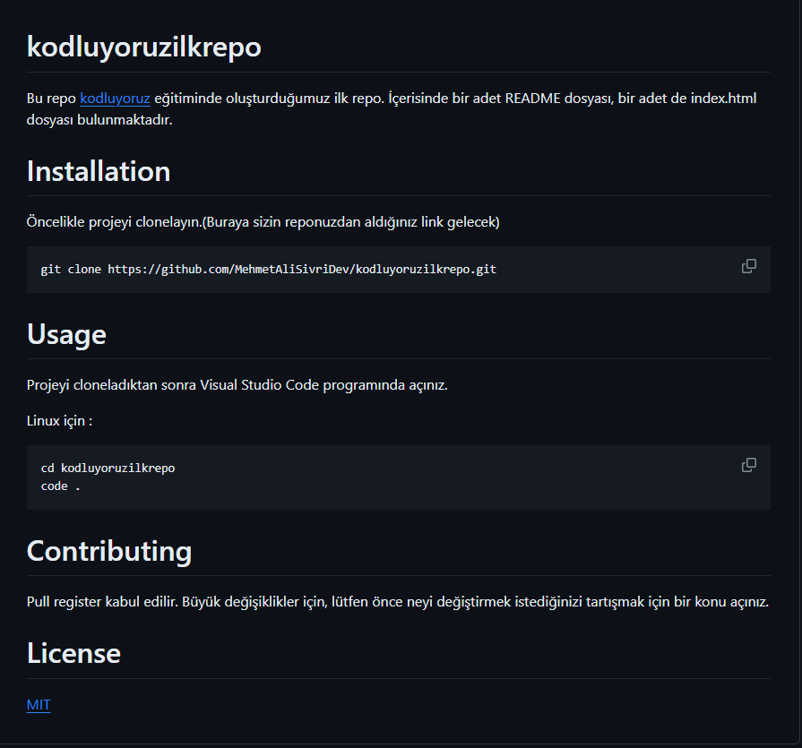

# kodluyoruzilkrepo

Bu repo [kodluyoruz](https://academy.patika.dev/tr/paths/kotlin-ile-mobile-app-patikasi) eğitiminde oluşturduğumuz ilk repo.
İçerisinde bir adet README dosyası, bir adet de index.html dosyası bulunmaktadır.



# Installation

Öncelikle projeyi clonelayın.(Buraya sizin reponuzdan aldığınız link gelecek)

```
git clone https://github.com/MehmetAliSivriDev/kodluyoruzilkrepo.git
```
# Usage

Projeyi cloneladıktan sonra Visual Studio Code programında açınız.

Linux için :

```
cd kodluyoruzilkrepo
code .
```

# Contributing

Pull register kabul edilir. Büyük değişiklikler için, lütfen önce neyi değiştirmek istediğinizi tartışmak için
bir konu açınız.

# License 

[MIT](https://choosealicense.com/licenses/mit/)